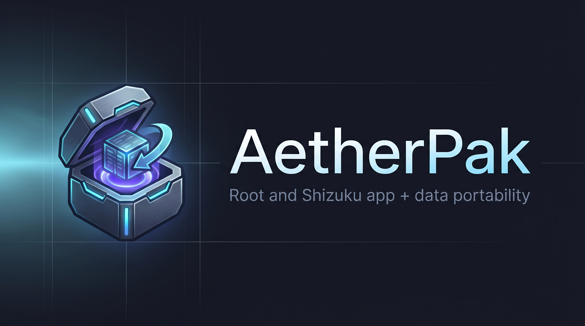

<div align="center">



**Full-portable Android app + data backup and migration.**
APK + splits, OBB, external data, and private `/data/data` packed into one streaming `.ark`
archive and faithfully restored on another device with ownership and SELinux contexts repaired.

`Kotlin` · `Jetpack Compose / Material 3` · `Rust JNI compression core` · `Root (libsu)` · `Shizuku`

---

**[⬇ Download APK](https://github.com/zorg/aetherpak/releases)** &nbsp;·&nbsp; **[Documentation](#)** &nbsp;·&nbsp; **[Report Bug](https://github.com/zorg/aetherpak/issues)**

</div>

---

## Features

- **Full app + data migration** — backup everything needed to clone an app onto another device
- **Streaming `.ark` archive** — GB-scale OBB/game files compress in constant RAM via Rust JNI
- **Three codecs** — Zstandard (default), ZIP/deflate, 7z/LZMA2
- **Ownership & SELinux repair** — UID remapping + `restorecon` so restored apps actually launch
- **Honest capability matrix** — Shizuku mode tells you upfront that private `/data/data` is unavailable
- **Local backup catalog** — Room database tracks all backups with manifest preview
- **Material 3 UI** — Jetpack Compose with dynamic color on Android 12+

## Backends

| Backend | Mechanism | Capability |
|---------|-----------|------------|
| **Root** | `su` via libsu (Magisk / KernelSU / APatch) | FULL — APK + OBB + external data + private `/data/data` |
| **Shizuku** | ADB shell (UID 2000) via Shizuku UserService | PARTIAL — APK + OBB + external data (no private data) |

> **Why no private data on Shizuku?** The Android kernel sandbox forbids the ADB shell (UID 2000) from reading another app's `/data/data/<pkg>`. Only a real superuser can. AetherPak never pretends otherwise — Shizuku backups are flagged `partial` and the UI makes this visible.

## Quick Start

### Prerequisites

- **Android Studio** Koala+ or command-line SDK
- **JDK 17**, Android SDK 34, NDK r26+
- **Rust** (stable) with Android targets and `cargo-ndk`

### 1. Install Rust toolchain

```bash
rustup target add aarch64-linux-android armv7-linux-androideabi x86_64-linux-android
cargo install cargo-ndk
```

### 2. Build the native compression core

```bash
cd rust/aetherpak-core
cargo ndk \
  -t aarch64-linux-android \
  -t armv7-linux-androideabi \
  -t x86_64-linux-android \
  -o ../../core/compress/src/main/jniLibs \
  build --release
```

### 3. Build the APK

```bash
# From repo root
./gradlew :app:assembleDebug    # Debug APK
./gradlew :app:assembleRelease  # Release APK (requires keystore)
```

APK output: `app/build/outputs/apk/debug/app-debug.apk`

### Release signing (optional)

Create `keystore.properties` at the repo root:

```properties
storeFile=/absolute/path/to/release.keystore
storePassword=********
keyAlias=aetherpak
keyPassword=********
```

When absent, release builds fall back to debug signing.

## Architecture

```
                          +-----------------------------------------------+
                          |                    :app                       |
                          |   Jetpack Compose · Material 3 · Navigation  |
                          |   ServiceLocator (manual DI) + ViewModels    |
                          +----------------------+------------------------+
                                                 |
        +---------------+---------+-------+-------+--------+---------------+
        |               |         |       |                |               |
+-------v----+  +------v---+  +--v-----+  +-----v-----+  +-----v-----+  +-----v-----+
| :core:     |  | :core:   |  | :core: |  | :core:     |  | :core:     |  | :core:    |
| access     |  | backup   |  | restore|  | data       |  | compress   |  | common    |
|            |  |          |  |        |  |            |  |            |  |           |
| Root(libsu)|  | AppScan  |  | Restore|  | Room DB    |  | NativeArch |  | Contracts |
| Shizuku    |  | BackupEng|  | UidMap |  | DataStore  |  | JNI loader |  | Models    |
+-----+------+  +----+-----+  +---+----+  +-----------+  +-----+------+  +-----------+
      |               |           |                              |
      |               +-----+-----+------------------------------+
      |                     |                                    |
      |             +-------v------------------------v-----------+
      |             |                                  |
      |             |      rust/aetherpak-core         |
      |             |      libaetherpak.so (cdylib)    |
      |             |      zstd | zip | 7z | tar      |
      |             +----------------------------------+
      |
      |  elevated shell + file I/O
      v
+-----------------------------------------------------+
|  Android device                                      |
|  su (root)  ·  Shizuku UserService (ADB UID 2000)   |
+-----------------------------------------------------+
```

## Module Map

| Module | Role |
|--------|------|
| `:core:common` | Pure contracts: `AccessProvider`, `NativeArchive`, `BackupEngine`, `RestoreEngine`, manifest, models |
| `:core:access` | `RootAccessProvider` (libsu), `ShizukuAccessProvider` (AIDL UserService), `AccessManager` detection |
| `:core:compress` | `NativeBridge` (JNI `external` decls), `AetherArchive : NativeArchive`, graceful `isAvailable()` |
| `:core:backup` | `AppScanner` (enumerate installed apps), `BackupEngineImpl` (walk -> stream -> manifest) |
| `:core:restore` | `RestoreEngineImpl` (install -> extract -> repair), `UidResolver`, permission fixing |
| `:core:data` | Room `AetherDatabase` + `BackupDao` + `BackupRepository`, `SettingsStore` (DataStore) |
| `:app` | Compose UI (Home, Backup, Restore, Detail, Settings, Access Setup), ServiceLocator DI, theme |
| `rust/aetherpak-core` | `cdylib` native compression core — zstd, zip, 7z, tar streaming |

## `.ark` Archive Format

A single streamed container with entries written header-then-payload:

```
apk/<basename>.apk            Base + split packages
obb/<relative>                /sdcard/Android/obb/<pkg>/...
external_data/<relative>      /sdcard/Android/data/<pkg>/...
private_data/<relative>       /data/data/<pkg>/...         (Root only)
manifest.json                 ALWAYS the final entry         (TOC + provenance)
```

`manifest.json` records per-entry: original `devicePath`, octal `mode`, source `uid`/`gid`, and SELinux `seContext`. Top-level: `sourceUid`, `isPartial` flag.

## UID Remapping (Why Restore Works)

Android assigns each app a private Linux UID (`AID_APP_START = 10000+`) **sequentially at install time**. The same package gets a different UID on a different device. If restored files keep the old owner, the app crashes on launch.

AetherPak applies a delta remap:

```
delta       = newAppUid - manifest.sourceUid
remappedUid = originalUid + delta   (only for app-range UIDs 10000..19999)
```

Then each restored node is `chown`-ed, `chmod`-ed, and the tree is `restorecon -R`-ed. Shared storage (OBB/external on FUSE `/sdcard`) skips ownership — the kernel manages it.

## Usage

1. **Access Setup** — detects Root/Shizuku, requests grants, states what each backend can/cannot do
2. **Home** — pick an installed app, see capability banner
3. **Backup** — choose codec + components, stream progress live, catalogued locally
4. **Restore** — from local catalogue or open external `.ark`, manifest preview with warnings

## Tech Stack

| Layer | Technology |
|-------|-----------|
| UI | Jetpack Compose, Material 3 |
| DI | Manual `ServiceLocator` (no Hilt/Koin) |
| Database | Room (SQLite) + DataStore (Preferences) |
| Compression | Rust JNI `cdylib` (zstd 0.13, zip 0.6, sevenz-rust 0.6, tar 0.4) |
| Root access | libsu 6.0 (topjohnwu) |
| Shizuku access | Shizuku API 13 + AIDL UserService |

## License

**AetherPak** — [GNU General Public License v3.0](LICENSE)

The Rust native compression core (`rust/aetherpak-core`) is also available under Apache 2.0.

---

<div align="center">
<b>Scope & Safety:</b> AetherPak is an <b>owner-scoped</b> tool — it backs up and migrates the device
owner's own apps and data. Every privileged action requires explicit Root or Shizuku grant.
No credential extraction, no tampering with other users, no network exfiltration.
</div>
